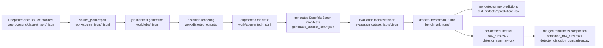

# Distortion-to-Detector Integration Walkthrough

## Purpose
This document shows, step by step, how a clean DeepfakeBench dataset was transformed into distorted evaluation datasets and then passed through the selected champion detectors.

Representative completed run used in this walkthrough:
- `/Users/Hao/thesis-project/training/results/final_full_thesis_matrix_top3`

This run contains:
- clean datasets: `Dataset-1`, `NVIDIA-dataset`
- distorted variants: `gaussian_blur_v1`, `jpeg_compress_v1`, `noise_v1`, `snapchat_text_overlay_v1`
- detectors: `mesonet`, `mesoinception`, `xception`

## End-to-End Flow


## Top-Level Artifact Layout
From:
- `/Users/Hao/thesis-project/training/results/final_full_thesis_matrix_top3`

```text
final_full_thesis_matrix_top3/
  benchmark_runs/
  evaluation_dataset_json/
  generated_dataset_json/
  orchestrator_logs/
  work/
  combined_raw_runs.csv
  detector_distortion_comparison.csv
  detector_distortion_summary.csv
  distortion_champion_report.md
  dataset_index.csv
  generated_dataset_index.csv
  run_config.json
```

## Step 1: Start From The Original Dataset Manifest
The clean benchmark datasets are defined in DeepfakeBench JSON manifests, for example:
- `/Users/Hao/thesis-project/preprocessing/dataset_json/Dataset-1.json`
- `/Users/Hao/thesis-project/preprocessing/dataset_json/NVIDIA-dataset.json`

These are the source-of-truth test splits used by `training/test.py`.

## Step 2: Export The Source Dataset Into Flat JSONL
The orchestrator exports the DeepfakeBench test split into a flat image-level JSONL file.

Example file:
- `/Users/Hao/thesis-project/training/results/final_full_thesis_matrix_top3/work/source_jsonl/Dataset-1__test.jsonl`

Example rows:
```json
{"image_id": "000001", "label": "roop_Fake", "path": "/Users/Hao/thesis-project/datasets/Dataset-1/AI-Generated Images/000001.jpg", "source_dataset_name": "Dataset-1", "source_split": "test", "source_sample_id": "000001"}
{"image_id": "000002", "label": "roop_Fake", "path": "/Users/Hao/thesis-project/datasets/Dataset-1/AI-Generated Images/000002.jpg", "source_dataset_name": "Dataset-1", "source_split": "test", "source_sample_id": "000002"}
```

What changed here:
- the nested DeepfakeBench structure was flattened into one record per image
- original sample identity was preserved via fields such as:
  - `source_dataset_name`
  - `source_sample_id`
  - `source_frame_path`

## Step 3: Expand Each Source Image Into Distortion Jobs
The distortion pipeline then created one job per image per recipe.

Example file:
- `/Users/Hao/thesis-project/training/results/final_full_thesis_matrix_top3/work/jobs/Dataset-1.jsonl`

Example rows for image `000001`:
```json
{"image_id": "000001", "recipe_id": "gaussian_blur_v1", "recipe_instance_id": "gaussian_blur_v1__4a1525bdf7", "recipe_label": "gaussian_blur", "steps": [{"name": "gaussian_blur", "params": {"sigma": 1.2}}]}
{"image_id": "000001", "recipe_id": "jpeg_compress_v1", "recipe_instance_id": "jpeg_compress_v1__074f6a9a12", "recipe_label": "jpeg", "steps": [{"name": "jpeg", "params": {"quality": 60}}]}
{"image_id": "000001", "recipe_id": "noise_v1", "recipe_instance_id": "noise_v1__d23d8d061a", "recipe_label": "noise", "steps": [{"name": "noise", "params": {"std": 10.0}}]}
```

For the full matrix run, this expansion produced:
- `38,520` jobs for `Dataset-1`
- `80,000` jobs for `NVIDIA-dataset`

These counts are recorded in:
- `/Users/Hao/thesis-project/training/results/final_full_thesis_matrix_top3/orchestrator_logs/generate_manifest__Dataset-1.log`
- `/Users/Hao/thesis-project/training/results/final_full_thesis_matrix_top3/orchestrator_logs/generate_manifest__NVIDIA-dataset.log`

## Step 4: Render Distorted Images Into `work/distorted_outputs`
The distortion renderer materialized the actual image files under:
- `/Users/Hao/thesis-project/training/results/final_full_thesis_matrix_top3/work/distorted_outputs`

Folder pattern:
```text
work/distorted_outputs/
  Dataset-1/
    gaussian_blur_v1/
      roop_Fake/
      roop_Real/
    jpeg_compress_v1/
      roop_Fake/
      roop_Real/
    noise_v1/
      roop_Fake/
      roop_Real/
    snapchat_text_overlay_v1/
      roop_Fake/
      roop_Real/
  NVIDIA-dataset/
    ...
```

Example distorted files for text overlay:
- `/Users/Hao/thesis-project/training/results/final_full_thesis_matrix_top3/work/distorted_outputs/Dataset-1/snapchat_text_overlay_v1/roop_Fake/000001__snapchat_text_overlay_v1__ddc9a26517__v0.png`
- `/Users/Hao/thesis-project/training/results/final_full_thesis_matrix_top3/work/distorted_outputs/Dataset-1/snapchat_text_overlay_v1/roop_Fake/000002__snapchat_text_overlay_v1__ddc9a26517__v0.png`

What changed here:
- the original image file was physically rewritten into one new file per distortion recipe
- the output filename encoded:
  - original image id
  - recipe instance id
  - variant id

## Step 5: Record Distorted Paths In The Augmented Manifest
After rendering, the pipeline wrote an augmented manifest that linked each source image to its distorted output.

Example file:
- `/Users/Hao/thesis-project/training/results/final_full_thesis_matrix_top3/work/augmented/Dataset-1.jsonl`

Example row:
```json
{"image_id": "000001", "recipe_id": "gaussian_blur_v1", "seed": 701592323, "cache_key": "2f965c...", "distorted_path": "/Users/Hao/thesis-project/training/results/final_full_thesis_matrix_top3/work/distorted_outputs/Dataset-1/gaussian_blur_v1/roop_Fake/000001__gaussian_blur_v1__4a1525bdf7__v0.png"}
```

What changed here:
- the manifest now knows exactly which distorted file belongs to each job
- the process is reproducible because the manifest preserves:
  - `seed`
  - `cache_key`
  - `recipe_instance_id`
  - `distorted_path`

## Step 6: Convert Distorted Outputs Back Into DeepfakeBench Dataset JSON
The augmented distortion manifest was then converted into DeepfakeBench-compatible dataset manifests.

Generated files:
- `/Users/Hao/thesis-project/training/results/final_full_thesis_matrix_top3/generated_dataset_json/Dataset-1__gaussian_blur_v1__4a1525bdf7__v0.json`
- `/Users/Hao/thesis-project/training/results/final_full_thesis_matrix_top3/generated_dataset_json/Dataset-1__jpeg_compress_v1__074f6a9a12__v0.json`
- `/Users/Hao/thesis-project/training/results/final_full_thesis_matrix_top3/generated_dataset_json/Dataset-1__noise_v1__d23d8d061a__v0.json`
- `/Users/Hao/thesis-project/training/results/final_full_thesis_matrix_top3/generated_dataset_json/Dataset-1__snapchat_text_overlay_v1__ddc9a26517__v0.json`
- and the corresponding four files for `NVIDIA-dataset`

What changed here:
- the distortion pipeline output was translated back into the exact manifest format that `training/test.py` already knows how to consume
- no detector code had to be rewritten for each distortion

## Step 7: Build A Unified Evaluation Folder For Clean + Distorted Datasets
The orchestrator then assembled one evaluation folder containing both:
- clean dataset manifests
- distorted dataset manifests

Folder:
- `/Users/Hao/thesis-project/training/results/final_full_thesis_matrix_top3/evaluation_dataset_json`

Contents:
- `Dataset-1.json`
- `NVIDIA-dataset.json`
- `Dataset-1__gaussian_blur_v1__4a1525bdf7__v0.json`
- `Dataset-1__jpeg_compress_v1__074f6a9a12__v0.json`
- `Dataset-1__noise_v1__d23d8d061a__v0.json`
- `Dataset-1__snapchat_text_overlay_v1__ddc9a26517__v0.json`
- corresponding `NVIDIA-dataset__...` files

This folder is the direct interface between the distortion pipeline and the detector benchmark.

## Step 8: Run The Same Detectors On Every Dataset Variant
The benchmark runner then evaluated:
- clean `Dataset-1`
- clean `NVIDIA-dataset`
- all distorted variants for both datasets

Per-dataset benchmark outputs are in:
- `/Users/Hao/thesis-project/training/results/final_full_thesis_matrix_top3/benchmark_runs`

Example benchmark directories:
- `/Users/Hao/thesis-project/training/results/final_full_thesis_matrix_top3/benchmark_runs/Dataset-1`
- `/Users/Hao/thesis-project/training/results/final_full_thesis_matrix_top3/benchmark_runs/Dataset-1__snapchat_text_overlay_v1__ddc9a26517__v0`
- `/Users/Hao/thesis-project/training/results/final_full_thesis_matrix_top3/benchmark_runs/NVIDIA-dataset__noise_v1__d23d8d061a__v0`

Each benchmark directory contains:
- `raw_runs.csv`
- `detector_summary.csv`
- `leaderboard.md`
- `champions.json`

## Step 9: Save Per-Detector Predictions And Metrics
For each detector-dataset pair, the pipeline exported raw detector outputs.

Example files:
- `/Users/Hao/thesis-project/training/results/final_full_thesis_matrix_top3/benchmark_runs/Dataset-1__snapchat_text_overlay_v1__ddc9a26517__v0/test_artifacts/mesonet__Dataset-1__snapchat_text_overlay_v1__ddc9a26517__v0/Dataset-1__snapchat_text_overlay_v1__ddc9a26517__v0/predictions.csv`
- `/Users/Hao/thesis-project/training/results/final_full_thesis_matrix_top3/benchmark_runs/Dataset-1__snapchat_text_overlay_v1__ddc9a26517__v0/test_artifacts/mesonet__Dataset-1__snapchat_text_overlay_v1__ddc9a26517__v0/Dataset-1__snapchat_text_overlay_v1__ddc9a26517__v0/metrics.json`

The same structure exists for:
- `mesonet`
- `mesoinception`
- `xception`

What changed here:
- the detector stage produced both:
  - aggregate metrics
  - raw per-sample predictions

This is the point where distorted datasets became measurable detector outcomes.

## Step 10: Merge Clean And Distorted Results For Robustness Analysis
Finally, the orchestrator merged all benchmark outputs into one comparison layer.

Final merged files:
- `/Users/Hao/thesis-project/training/results/final_full_thesis_matrix_top3/combined_raw_runs.csv`
- `/Users/Hao/thesis-project/training/results/final_full_thesis_matrix_top3/detector_distortion_comparison.csv`
- `/Users/Hao/thesis-project/training/results/final_full_thesis_matrix_top3/detector_distortion_summary.csv`
- `/Users/Hao/thesis-project/training/results/final_full_thesis_matrix_top3/distortion_champion_report.md`

This is where the final robustness metrics such as:
- `mean_delta_auc`
- `worst_delta_auc`
- `mean_delta_ap`
- `mean_delta_eer`

were computed across distortions.

## Worked Example: One Image Through The Pipeline
Example source image:
- `/Users/Hao/thesis-project/datasets/Dataset-1/AI-Generated Images/000001.jpg`

Step mapping:
1. Source JSONL row:
- `/Users/Hao/thesis-project/training/results/final_full_thesis_matrix_top3/work/source_jsonl/Dataset-1__test.jsonl`

2. One generated job for JPEG:
- `/Users/Hao/thesis-project/training/results/final_full_thesis_matrix_top3/work/jobs/Dataset-1.jsonl`
- `recipe_id = jpeg_compress_v1`

3. One augmented result row:
- `/Users/Hao/thesis-project/training/results/final_full_thesis_matrix_top3/work/augmented/Dataset-1.jsonl`
- `distorted_path = .../work/distorted_outputs/Dataset-1/jpeg_compress_v1/roop_Fake/000001__jpeg_compress_v1__074f6a9a12__v0.png`

4. One generated DeepfakeBench dataset manifest:
- `/Users/Hao/thesis-project/training/results/final_full_thesis_matrix_top3/generated_dataset_json/Dataset-1__jpeg_compress_v1__074f6a9a12__v0.json`

5. One detector prediction export for that dataset variant:
- `/Users/Hao/thesis-project/training/results/final_full_thesis_matrix_top3/benchmark_runs/Dataset-1__jpeg_compress_v1__074f6a9a12__v0/test_artifacts/xception__Dataset-1__jpeg_compress_v1__074f6a9a12__v0/Dataset-1__jpeg_compress_v1__074f6a9a12__v0/predictions.csv`

This shows the full linkage from clean image to distorted image to detector output.

## How To Demonstrate This Visually
A strong demonstration order is:
1. Show the original source manifest location:
- `/Users/Hao/thesis-project/preprocessing/dataset_json/Dataset-1.json`

2. Show the exported flat test JSONL:
- `/Users/Hao/thesis-project/training/results/final_full_thesis_matrix_top3/work/source_jsonl/Dataset-1__test.jsonl`

3. Show how one source image expands into multiple jobs:
- `/Users/Hao/thesis-project/training/results/final_full_thesis_matrix_top3/work/jobs/Dataset-1.jsonl`

4. Show the actual distorted image folders:
- `/Users/Hao/thesis-project/training/results/final_full_thesis_matrix_top3/work/distorted_outputs/Dataset-1/`

5. Show the generated dataset manifests:
- `/Users/Hao/thesis-project/training/results/final_full_thesis_matrix_top3/generated_dataset_json/`

6. Show the evaluation folder that the detectors actually used:
- `/Users/Hao/thesis-project/training/results/final_full_thesis_matrix_top3/evaluation_dataset_json/`

7. Show one benchmark output folder:
- `/Users/Hao/thesis-project/training/results/final_full_thesis_matrix_top3/benchmark_runs/Dataset-1__snapchat_text_overlay_v1__ddc9a26517__v0`

8. Show one prediction file and one metrics file:
- `predictions.csv`
- `metrics.json`

9. Finish with the merged comparison outputs:
- `/Users/Hao/thesis-project/training/results/final_full_thesis_matrix_top3/detector_distortion_comparison.csv`
- `/Users/Hao/thesis-project/training/results/final_full_thesis_matrix_top3/detector_distortion_summary.csv`
